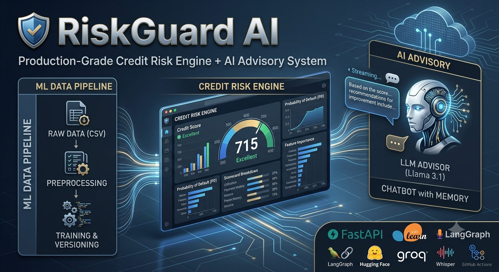
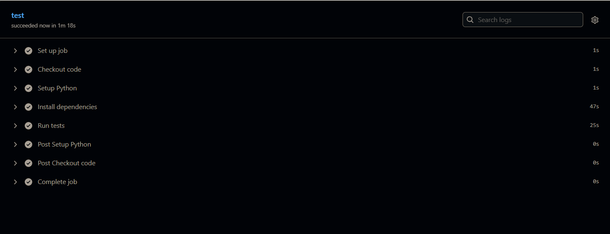

## 🛡️ RiskGuard AI

### Production-Grade Credit Risk Engine + AI Advisory System

---

## 🔗 Live Demo

> 🚀 **[Try the Live App →](https://junaidariie.github.io/Credit-Risk-Model/)**

---

## 🚀 Project Overview

**RiskGuard AI** is an end-to-end, production-style **credit risk decisioning platform** that simulates how modern banks and fintech companies evaluate loan applications.

It combines:

* **Machine Learning risk modeling**
* **Scorecard-based credit scoring logic**
* **Config-driven data pipelines**
* **JWT-based authentication & role-based access control (RBAC)**
* **MySQL-backed user & prediction persistence**
* **AI-powered advisory (LLM)**
* **Conversational chatbot with stateful memory**
* **Speech-to-Text (STT) & Text-to-Speech (TTS)**
* **Streaming real-time responses**
* **iOS-inspired React frontend (Vite + Framer Motion)**

This project is intentionally built to resemble **real enterprise ML architecture**, not notebook-style demos.

---

## 🎯 Core Capabilities

| Capability | Description |
| --- | --- |
| 📊 **Credit Risk Prediction** | Logistic Regression model predicts probability of default |
| 🧮 **Scorecard Engine** | Converts probability into credit score (300–900 scale) |
| 🏷️ **Risk Rating** | Buckets customers into Poor / Average / Good / Excellent |
| 🔐 **JWT Authentication** | Secure register / login / logout with token blocklist |
| 👥 **Role-Based Access (RBAC)** | User and Admin roles with protected routes |
| 🗄️ **MySQL Persistence** | All users and prediction logs stored in a relational DB |
| 🤖 **AI Advisor (LLM)** | Explains decisions and gives improvement guidance |
| 💬 **Conversational Chatbot** | Follow-up questions with LangGraph memory & context |
| 🔊 **Text-to-Speech (TTS)** | Streams natural voice with subtitle (SRT) support |
| 🎙️ **Speech-to-Text (STT)** | Voice input via faster-whisper with language detection & translation |
| ⚡ **Streaming Responses** | Token-level streaming from backend to frontend |
| 🧠 **LangGraph Memory** | Stateful multi-turn conversations |
| 🌐 **Tavily Web Search** | Live knowledge augmentation for the chatbot |
| 📱 **React Frontend** | iOS-inspired dark UI, responsive for mobile & desktop |

---

## 📊 Evaluation Metrics

The final Logistic Regression evaluation was performed at the selected probability threshold of **`0.85`** using the experiment notebook.

### Final Classification Report

| Class | Precision | Recall | F1 Score | Support |
| --- | --- | --- | --- | --- |
| `0` (Good) | 0.98 | 0.97 | 0.98 | 11,423 |
| `1` (Default) | 0.74 | 0.81 | 0.78 | 1,074 |
| **Accuracy** | | | **0.96** | **12,497** |
| **Macro Avg** | **0.86** | **0.89** | **0.88** | **12,497** |
| **Weighted Avg** | **0.96** | **0.96** | **0.96** | **12,497** |

### Why Thresholding Was Applied

| Threshold | Precision | Recall | F1 Score |
| ---: | ---: | ---: | ---: |
| `0.50` | 0.541 | 0.948 | 0.689 |
| `0.70` | 0.634 | 0.903 | 0.745 |
| `0.80` | 0.689 | 0.868 | 0.768 |
| **`0.85`** | **0.722** | **0.836** | **0.775** |
| `0.90` | 0.766 | 0.791 | 0.778 |

The threshold was moved from `0.50` to **`0.85`** to obtain a more balanced precision-recall operating point for the default class.

---

## 📈 Model Selection & Thresholding

The notebook `Notebook/credit_risk_model.ipynb` documents the experiment workflow:

* Baseline comparison of Logistic Regression, Random Forest, and XGBoost
* Class imbalance handling via undersampling and SMOTETomek
* Optuna tuning of logistic regression hyperparameters
* Threshold analysis over probability cutoffs from `0.10` to `0.90`

The final model uses **Logistic Regression** for strong performance, interpretability, and direct compatibility with the scorecard framework. A threshold of **`0.85`** is used for the final evaluation.

---

## 📊 Dataset Overview

Three raw CSVs are merged during ingestion:

| File | Contents |
| --- | --- |
| `customers.csv` | Demographics: age, income, residence type |
| `loans.csv` | Loan attributes: amount, tenure, purpose, type |
| `bureau_data.csv` | Credit bureau: DPD, delinquency, utilization |

* **Size:** 50,000+ records
* **Target:** `default` (0 = good, 1 = default)

---

## 🧹 Data Preprocessing & Feature Engineering

Implemented in `src/preprocessing.py`:

* Normalizes categorical labels and cleans noisy categories
* Fills missing `residence_type` values with the mode
* Filters inconsistent loans by processing fee, GST, and net disbursement rules
* Derives risk-focused features: `loan_to_income`, `delinquency_ratio`, `avg_dpd_per_delinquency`
* Drops identifiers and redundant raw financial columns after feature creation

---

## 🏗️ Training Pipeline

Implemented in `src/train.py` and configured by `config/config.yaml`:

1. Load and merge raw CSVs from `data/raw/`
2. Clean and engineer features
3. One-hot encode categorical variables
4. Scale numeric inputs with `MinMaxScaler`
5. Handle class imbalance with `SMOTETomek`
6. Train `LogisticRegression` with tuned parameters
7. Save model artifact to `artifacts/model_data.joblib`

---

## 🧠 Credit Scorecard Logic

Implemented in `inference/predictor.py`:

* The logistic regression model outputs a default probability `PD`
* The scorecard converts `PD` into a credit score using: base score = `600`, base odds = `50`, PDO = `20`
* The output score is clamped to the range `300–900`

| Score Range | Rating |
| --- | --- |
| 300–499 | Poor |
| 500–649 | Average |
| 650–749 | Good |
| 750–900 | Excellent |

---

## 🔐 Authentication & Authorization

Implemented across `backend/auth/` and `backend/routers/auth_router.py`:

* **Registration** — `POST /auth/register` creates a new user with `bcrypt`-hashed password. Role is hardcoded to `"user"` to prevent privilege escalation.
* **Login** — `POST /auth/login` validates credentials and returns a signed **JWT** access token (HS256, configurable expiry via `.env`).
* **Logout** — `POST /auth/logout` adds the token to an in-memory blocklist, immediately invalidating it.
* **Token validation** — `get_current_user()` dependency decodes and verifies the JWT on every protected route, checking the blocklist first.
* **RBAC** — `require_role(["admin"])` dependency wrapper enforces role-based access on admin-only endpoints.

### JWT Configuration (`.env`)

```
SECRET_KEY=...
ALGORITHM=HS256
ACCESS_TOKEN_EXPIRE_MINUTES=60
```

---

## 🗄️ Database Layer

Implemented in `backend/db/`:

* **Engine** — SQLAlchemy with `mysql+pymysql` driver, connecting to a MySQL instance configured via `.env`
* **Session management** — `get_db()` dependency yields a scoped session per request
* **Auto-migration** — `Base.metadata.create_all()` runs on startup to create tables if they don't exist
* **Default admin bootstrap** — On first startup, if no admin account exists, one is created from `ADMIN_USERNAME` / `ADMIN_PASSWORD` env vars

### Cloud Database — Aiven for MySQL

The production database is a **managed MySQL instance hosted on [Aiven](https://aiven.io)** — a fully managed cloud database platform. Aiven handles provisioning, backups, SSL, and high availability, so no self-managed database server is needed.

* Connection is SSL-encrypted by default (Aiven enforces this)
* The same `.env` variables are used — just swap `MYSQL_HOST`, `MYSQL_PORT`, `MYSQL_USER`, and `MYSQL_PASSWORD` with the values from the Aiven service overview
* Locally, a local MySQL instance can be used with the same config structure

### Database Models

**`users` table**

| Column | Type | Notes |
| --- | --- | --- |
| `user_id` | Integer PK | Auto-increment |
| `username` | String(50) | Unique, indexed |
| `password_hash` | String(255) | bcrypt hash |
| `role` | String(20) | `"user"` or `"admin"` |
| `is_active` | Boolean | Default `True` |

**`prediction_logs` table**

| Column | Type | Notes |
| --- | --- | --- |
| `id` | Integer PK | Auto-increment |
| `user_id` | FK → users | Indexed |
| `created_at` | DateTime | Auto UTC timestamp |
| `age`, `income`, `loan_amount`, … | Input features | All 11 input fields |
| `probability` | Float | Model output |
| `credit_score` | Integer | Scorecard output |
| `rating` | String(20) | Poor/Average/Good/Excellent |
| `advisor_response` | Text | Full LLM advisory text |

### MySQL Configuration (`.env`)

```
# Local development
MYSQL_USER=root
MYSQL_PASSWORD=...
MYSQL_HOST=localhost
MYSQL_PORT=3306
MYSQL_DATABASE=riskguard_db

# Production (Aiven for MySQL)
MYSQL_USER=avnadmin
MYSQL_PASSWORD=...
MYSQL_HOST=<your-service>.aivencloud.com
MYSQL_PORT=<aiven-port>
MYSQL_DATABASE=riskguard_db
```

---

## 👥 Role-Based Access Control

| Role | Capabilities |
| --- | --- |
| `user` | Register, login, run predictions, view own history, use chat/TTS/STT |
| `admin` | All user capabilities + view all users, view all predictions, promote users to admin, view system stats |

---

## 🌐 API Endpoints

### Authentication — `/auth`

| Method | Endpoint | Auth | Description |
| --- | --- | --- | --- |
| POST | `/auth/register` | ❌ | Register a new user account |
| POST | `/auth/login` | ❌ | Login and receive JWT token |
| POST | `/auth/logout` | ✅ | Invalidate current token |

### User — `/user`

| Method | Endpoint | Auth | Description |
| --- | --- | --- | --- |
| GET | `/user/me` | ✅ User | Get own profile (id, username, role) |
| GET | `/user/my-history` | ✅ User | Get own prediction history |

### Admin — `/admin`

| Method | Endpoint | Auth | Description |
| --- | --- | --- | --- |
| GET | `/admin/stats` | ✅ Admin | Total users & total predictions |
| GET | `/admin/users` | ✅ Admin | List all registered users |
| GET | `/admin/predictions` | ✅ Admin | List all predictions across all users |
| GET | `/admin/user/{user_id}/predictions` | ✅ Admin | Predictions for a specific user |
| PUT | `/admin/promote/{user_id}` | ✅ Admin | Promote a user to admin role |

### Core ML & AI

| Method | Endpoint | Auth | Description |
| --- | --- | --- | --- |
| GET | `/` | ❌ | Health check |
| POST | `/predict_credit_risk_stream` | ✅ User | Run prediction + stream advisor response |
| POST | `/chat` | ✅ User | Stream conversational chatbot reply |

### Voice

| Method | Endpoint | Auth | Description |
| --- | --- | --- | --- |
| POST | `/tts` | ✅ User | Stream TTS audio (MP3) |
| GET | `/subtitles/{request_id}` | ❌ | Fetch SRT subtitles for a TTS request |
| GET | `/tts_available_voices` | ❌ | List all available Edge TTS voices |
| POST | `/stt` | ✅ User | Transcribe uploaded audio file |
| GET | `/stt_supported_voices` | ❌ | List supported STT languages |

---

## 🤖 AI Advisory System

### One-Shot Advisor — `advisor_bot.py`

* Triggered immediately after each prediction
* Uses `openai/gpt-oss-120b` via Groq with a structured prompt
* Streams a personalised decision summary to the frontend token-by-token
* Tone adapts based on rating band (Excellent → encouraging, Poor → constructive)
* Full advisor text is saved to `prediction_logs.advisor_response` in MySQL

### Conversational Chatbot — `chatbot_advisor.py`

* Built with **LangGraph** `StateGraph` + `MemorySaver` for stateful multi-turn memory
* Equipped with **Tavily web search** tool for live knowledge augmentation
* Receives the full credit context (score, probability, rating, advisor summary) on first message
* Streams responses token-by-token via `llm.stream()`
* Chat session persists across frontend tab navigation; only resets on "New Assessment"

---

## 🔊 Voice & Interaction Layer

### TTS — `app.py` → `edge_tts`

* `POST /tts` streams MP3 audio directly to the browser
* Simultaneously builds SRT subtitles via `SubMaker`
* `GET /subtitles/{request_id}` returns the subtitle file after audio completes
* `GET /tts_available_voices` lists all available Edge TTS voices grouped by language
* Frontend settings: voice selection (grouped by language/region), speed, volume

### STT — `whisper_service.py` + `app.py`

* Loads `faster-whisper` base model on CPU with `int8` quantization
* `POST /stt` accepts audio upload, supports translation mode and language detection
* When **translation mode** is on, audio is translated to English
* When **language detection** is on, the detected language is returned and shown below the user's message in the chat UI
* `GET /stt_supported_voices` lists all supported transcription languages

---

## 📱 Frontend — React (Vite)

Located in `frontend/`, built with **React 19 + Vite 8**.

### Pages

| Page | Route | Description |
| --- | --- | --- |
| `AuthPage` | `/auth` | Login & registration with animated iOS-style segmented control |
| `PredictPage` | `/` | Assessment form, streaming results, AI advisor with TTS |
| `ChatPage` | `/chat` | Conversational advisor with STT mic, suggestion chips, streaming |
| `SettingsPage` | `/settings` | TTS voice/speed/volume, STT toggles, logout confirmation modal |
| `ProfilePage` | `/profile` | User info, prediction history; admin panel for user management |

### Key Frontend Features

* **iOS-inspired dark UI** — dark grey base (`#0d0d0f`), red/blue accents, SF-style typography, pill buttons, spring animations
* **Persistent session state** — prediction results, advisor text, and chat messages all persist across tab navigation via Zustand global store; only reset when "New Assessment" is clicked
* **New Assessment flow** — button appears after a result is generated; resets prediction, advisor, chat messages, and chat thread ID in one action
* **STT metadata tags** — when language detection or translation is enabled, coloured tags appear below the user's voice message showing detected language or translation notice
* **Streaming** — both the advisor output and chat responses stream token-by-token from the backend
* **Responsive** — works on mobile (Android) and desktop (Windows) with adaptive layouts

### Frontend Tech Stack

| Package | Version | Purpose |
| --- | --- | --- |
| `react` | 19 | UI framework |
| `vite` | 8 | Build tool & dev server |
| `react-router-dom` | 7 | Client-side routing |
| `framer-motion` | 13 | Animations & transitions |
| `zustand` | 5 | Global state management |
| `axios` | 1 | HTTP client |
| `react-markdown` | 10 | Render LLM markdown output |
| `lucide-react` | latest | Icon library |
| `uuid` | 14 | Chat thread ID generation |

### Running the Frontend

```bash
cd frontend
npm install
npm run dev        # dev server at http://localhost:5173
npm run build      # production build
```

---

## 🗂️ Full Project Structure

```
Credit-Risk-Model/
│
├── .github/
│   └── workflows/
│       └── ci.yml                      # GitHub Actions CI — runs pytest on push to main
│
├── assets/                             # Images used in README
│
├── artifacts/
│   └── model_data.joblib               # Trained model artifact (model + scaler + columns)
│
├── backend/                            # Authentication, DB, and routing layer
│   ├── auth/
│   │   ├── jwt.py                      # JWT creation, validation, token blocklist, RBAC
│   │   └── utils.py                    # bcrypt password hashing & verification
│   ├── db/
│   │   ├── database.py                 # SQLAlchemy engine, session factory, MySQL connection
│   │   ├── models.py                   # ORM models: User, PredictionLog
│   │   └── schemas.py                  # Pydantic schemas: auth, prediction, chat, TTS
│   ├── routers/
│   │   ├── auth_router.py              # POST /auth/register, /auth/login, /auth/logout
│   │   ├── user_router.py              # GET /user/me, /user/my-history
│   │   └── admin_router.py             # GET/PUT /admin/stats, /users, /predictions, /promote
│   └── limiter.py                      # SlowAPI rate limiter (IP-based, 100 req/min default)
│
├── config/
│   └── config.yaml                     # Central config (data paths, model params, settings)
│
├── data/
│   └── raw/
│       ├── bureau_data.csv             # Credit bureau features
│       ├── customers.csv               # Customer demographics
│       └── loans.csv                   # Loan attributes
│
├── frontend/                           # React + Vite iOS-inspired UI
│   ├── public/
│   │   └── favicon.svg
│   ├── src/
│   │   ├── pages/
│   │   │   ├── AuthPage.jsx            # Login & registration page
│   │   │   ├── PredictPage.jsx         # Assessment form + streaming results + advisor
│   │   │   ├── ChatPage.jsx            # Conversational advisor chat with STT/TTS
│   │   │   ├── SettingsPage.jsx        # TTS/STT settings, voice picker modal, logout
│   │   │   ├── ProfilePage.jsx         # User profile, history, admin panel
│   │   │   └── MainLayout.jsx          # Top navbar with nav tabs + routing shell
│   │   ├── api.js                      # Axios instance with auto Bearer token injection
│   │   ├── store.js                    # Zustand global state (auth, session, chat, settings)
│   │   ├── App.jsx                     # Route guard (redirects to /auth if not logged in)
│   │   ├── main.jsx                    # React entry point
│   │   └── index.css                   # iOS design system (CSS variables, typography)
│   ├── package.json
│   └── vite.config.js
│
├── inference/
│   └── predictor.py                    # Inference logic: model prediction + scorecard
│
├── Notebook/
│   └── credit_risk_model.ipynb         # Experiment notebook (EDA, tuning, model selection)
│
├── src/
│   ├── ingestion.py                    # Data loading & merging
│   ├── preprocessing.py                # Cleaning + feature engineering
│   ├── train.py                        # Training pipeline
│   ├── evaluate.py                     # Model evaluation (AUC, metrics, threshold sweep)
│   └── utils.py                        # Config loader, versioning utilities
│
├── tests/
│   ├── test_ingestion.py
│   ├── test_preprocessing.py
│   ├── test_training.py
│   ├── test_evaluation.py
│   └── test_full_pipeline.py
│
├── advisor_bot.py                      # One-shot AI advisor (streaming, Groq LLM)
├── chatbot_advisor.py                  # Conversational AI (LangGraph + Tavily)
├── whisper_service.py                  # faster-whisper STT model loader
├── app.py                              # FastAPI app — routes, CORS, startup hook
├── Dockerfile                          # Hugging Face Spaces deployment
├── requirements.txt
├── .env                                # API keys, DB credentials, JWT config
└── README.md
```

---

## 🧭 High-Level Architecture

```
┌─────────────────────────────────────────────────────────────────┐
│                    React Frontend (Vite)                        │
│  AuthPage · PredictPage · ChatPage · SettingsPage · ProfilePage │
│           Zustand state · Framer Motion · react-markdown        │
└───────────────────────────┬─────────────────────────────────────┘
                            │  HTTP / Streaming (Bearer JWT)
                            ▼
┌─────────────────────────────────────────────────────────────────┐
│                      FastAPI  (app.py)                          │
│         CORS · SlowAPI rate limiting · startup hook             │
│                                                                 │
│  ┌──────────────┐  ┌──────────────┐  ┌───────────────────────┐ │
│  │ auth_router  │  │ user_router  │  │    admin_router       │ │
│  │ /register    │  │ /me          │  │ /stats /users         │ │
│  │ /login       │  │ /my-history  │  │ /predictions /promote │ │
│  │ /logout      │  └──────────────┘  └───────────────────────┘ │
│  └──────┬───────┘                                               │
│         │                                                       │
│  ┌──────▼──────────────────────────────────────────────────┐   │
│  │              backend/auth/                              │   │
│  │  jwt.py — token create/validate/blocklist/RBAC          │   │
│  │  utils.py — bcrypt hash & verify                        │   │
│  └──────┬──────────────────────────────────────────────────┘   │
│         │                                                       │
│  ┌──────▼──────────────────────────────────────────────────┐   │
│  │              backend/db/                                │   │
│  │  database.py — SQLAlchemy engine, MySQL, get_db()       │   │
│  │  models.py   — User, PredictionLog ORM models           │   │
│  │  schemas.py  — Pydantic validation schemas              │   │
│  └─────────────────────────────────────────────────────────┘   │
└──────────────────────────┬──────────────────────────────────────┘
                           │
          ┌────────────────┼──────────────────┐
          ▼                ▼                  ▼
┌──────────────┐  ┌─────────────────┐  ┌──────────────────────┐
│  ML Engine   │  │  AI Advisor     │  │  Conversational Bot  │
│              │  │  advisor_bot.py │  │  chatbot_advisor.py  │
│ predictor.py │  │  Groq LLM       │  │  LangGraph + Memory  │
│ scorecard    │  │  streaming      │  │  Tavily web search   │
│ 300–900      │  └────────┬────────┘  └──────────┬───────────┘
└──────┬───────┘           │                      │
       │                   ▼                      ▼
       │          ┌─────────────────┐   ┌──────────────────────┐
       │          │   TTS Engine    │   │   TTS Engine         │
       │          │   edge_tts      │   │   edge_tts           │
       │          │   MP3 + SRT     │   │   MP3 + SRT          │
       │          └─────────────────┘   └──────────────────────┘
       ▼
┌──────────────────┐
│   STT Engine     │
│ whisper_service  │
│ faster-whisper   │
│ translate + lang │
└──────────────────┘
       │
       ▼
┌──────────────────┐
│   MySQL DB           │
│  Aiven Cloud         │
│  riskguard_db        │
│  users               │
│  prediction_logs     │
└──────────────────────┘
```

---

## ⚙️ Testing

```bash
pytest tests/
# or individually:
python tests/test_ingestion.py
python tests/test_preprocessing.py
python tests/test_training.py
python tests/test_evaluation.py
python tests/test_full_pipeline.py
```

---

## 🔄 CI/CD Pipeline

Fully automated **GitHub Actions CI pipeline** (`.github/workflows/ci.yml`).
All tests run automatically on every push to `main`.

✅ **CI Status: All tests passing**



---

## 🛠️ Tech Stack

| Layer | Tech |
| --- | --- |
| Frontend | React 19, Vite 8, Framer Motion, Zustand, react-markdown |
| Routing | React Router DOM v7 |
| Backend | FastAPI + Uvicorn |
| Auth | JWT (python-jose), bcrypt, SlowAPI rate limiting |
| Database | MySQL (Aiven cloud) + SQLAlchemy + PyMySQL |
| ML | Pandas, NumPy, Scikit-learn, XGBoost, Optuna |
| Imbalance | imbalanced-learn (SMOTETomek) |
| LLM | Groq (`openai/gpt-oss-120b`) |
| Memory | LangGraph + MemorySaver |
| Search | Tavily API |
| TTS | Edge TTS (streaming + SRT subtitles) |
| STT | faster-whisper (base, CPU, int8) |
| Deployment | Hugging Face Spaces, Docker |

---

## 🎯 Real-World Relevance

This project closely resembles:

* Bank credit engines with user authentication and audit logs
* Fintech underwriting systems with role-based access
* Risk analytics platforms with persistent prediction history
* AI-powered financial advisors with voice interaction

It is designed to demonstrate **production thinking, not just ML modeling**.

---

## 👤 Author

**Junaid**
AI / Machine Learning Engineer
Focused on building production-grade, real-world AI systems.

---

## ⭐ Final Note

RiskGuard AI is intentionally engineered to show:

* Proper multi-source data pipelines
* Config-driven architecture
* Single versioned model artifact
* Scorecard logic with interpretable output
* JWT auth + RBAC + MySQL persistence
* LLM + memory + tool-use AI integration
* Streaming audio/text responses
* iOS-inspired React frontend with persistent session state
* Enterprise-style testing discipline
