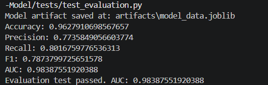

## 🛡️ RiskGuard AI

### Production-Grade Credit Risk Engine + AI Advisory System

---

## 🔗 Live Demo

> 🚀 **[Try the Live App →](https://junaidariie.github.io/Credit-Risk-Model/)**

---

## 🧭 High-Level Architecture (RiskGuard AI)

```
                        ┌────────────────────────────┐
                        │        Frontend UI         │
                        │  index.html (Form + Chat)  │
                        └──────────────┬─────────────┘
                                       │
                                       ▼
                        ┌────────────────────────────┐
                        │           FastAPI          │
                        │        app.py (API)        │
                        └──────────────┬─────────────┘
                                       │
             ┌─────────────────────────┼─────────────────────────┐
             │                         │                         │
             ▼                         ▼                         ▼
    ┌──────────────────┐    ┌──────────────────────┐    ┌──────────────────────┐
    │ Credit Risk      │    │ Insight Generator    │    │ Loan Chat Assistant  │
    │ Prediction API   │    │  advisor_bot.py      │    │ chatbot_advisor.py   │
    │ (ML Model)       │    └──────────┬───────────┘    └──────────┬───────────┘
    └─────────┬────────┘               │                           │
              │                        ▼                           ▼
              │              ┌──────────────────────┐   ┌──────────────────────┐
              │              │  Prompt + LLM Logic  │   │  LangGraph + Memory  │
              │              │  (Groq / GPT-OSS)    │   │  + Tavily Web Search │
              │              └──────────┬───────────┘   └──────────┬───────────┘
              │                         │                          │
              │                         ▼                          ▼
    ┌──────────────────┐     ┌──────────────────────┐   ┌──────────────────────┐
    │ Feature Pipeline │     │  TTS Engine          │   │  TTS Engine          │
    │ inference/       │     │  edge_tts (stream)   │   │  edge_tts (stream)   │
    │ predictor.py     │     └──────────────────────┘   └──────────────────────┘
    └──────────────────┘
              │
              ▼
    ┌──────────────────┐
    │  STT Engine      │
    │  whisper_service │
    │  (faster-whisper)│
    └──────────────────┘
```

---

## 🚀 Project Overview

**RiskGuard AI** is an end-to-end, production-style **credit risk decisioning platform** that simulates how modern banks and fintech companies evaluate loan applications.

It combines:

* **Machine Learning risk modeling**
* **Scorecard-based credit scoring logic**
* **Config-driven data pipelines**
* **AI-powered advisory (LLM)**
* **Conversational chatbot with memory**
* **Speech-to-Text (STT) & Text-to-Speech (TTS)**
* **Streaming real-time responses**

This project is intentionally built to resemble **real enterprise ML architecture**, not notebook-style demos.

---

## 🎯 Core Capabilities

| Capability                    | Description                                               |
| ----------------------------- | --------------------------------------------------------- |
| 📊 **Credit Risk Prediction** | Logistic Regression model predicts probability of default |
| 🧮 **Scorecard Engine**       | Converts probability into credit score (300–900 scale)    |
| 🏷️ **Risk Rating**           | Buckets customers into Poor / Average / Good / Excellent  |
| 🤖 **AI Advisor (LLM)**       | Explains decisions and gives improvement guidance         |
| 💬 **Conversational Chatbot** | Follow-up questions with memory & context                 |
| 🔊 **Text-to-Speech (TTS)**   | Streams natural voice with subtitle (SRT) support        |
| 🎙️ **Speech-to-Text (STT)**  | Voice input via faster-whisper with language detection    |
| ⚡ **Streaming Responses**     | Token-level streaming from backend                        |
| 🧠 **LangGraph Memory**       | Stateful multi-turn conversations                         |
| 🌐 **Tavily Web Search**      | Live knowledge augmentation for the chatbot               |

---

## 🗂️ Production-Grade Project Structure

```
Credit-Risk-Model/
│
├── .github/
│   └── workflows/
│       └── ci.yml                  # GitHub Actions CI pipeline
│
├── assets/                         # Images used in README
│
├── artifacts/
│   └── model_data.joblib           # Trained model artifact (model + scaler + columns)
│
├── config/
│   └── config.yaml                 # Central config (paths, params, model settings)
│
├── data/
│   └── raw/
│       ├── bureau_data.csv         # Credit bureau features
│       ├── customers.csv           # Customer demographics
│       └── loans.csv               # Loan attributes
│
├── src/
│   ├── ingestion.py                # Data loading & merging
│   ├── preprocessing.py            # Cleaning + feature engineering
│   ├── train.py                    # Training pipeline
│   ├── evaluate.py                 # Model evaluation (AUC, metrics, threshold)
│   └── utils.py                    # Config loader, versioning utilities
│
├── inference/
│   └── predictor.py                # Inference logic (scorecard + model)
│
├── tests/
│   ├── test_ingestion.py
│   ├── test_preprocessing.py
│   ├── test_training.py
│   ├── test_evaluation.py
│   └── test_full_pipeline.py
│
├── tts_outputs/                    # Cached TTS audio files (mp3)
│
├── advisor_bot.py                  # One-time AI insight generator (streaming)
├── chatbot_advisor.py              # Conversational AI assistant (LangGraph)
├── whisper_service.py              # Faster-Whisper STT model loader
├── app.py                          # FastAPI application
├── credit_risk_model.ipynb         # Experiment notebook (EDA, tuning, selection)
├── index.html                      # Frontend UI
├── Dockerfile                      # Hugging Face Spaces deployment
├── requirements.txt
└── README.md
```

---

## 📊 Dataset Overview

Three raw CSVs are merged during ingestion:

| File               | Contents                                      |
| ------------------ | --------------------------------------------- |
| `customers.csv`    | Demographics: age, income, residence type     |
| `loans.csv`        | Loan attributes: amount, tenure, purpose, type |
| `bureau_data.csv`  | Credit bureau: DPD, delinquency, utilization  |

* **Size:** 50,000+ records
* **Target:** `default` (0 = good, 1 = default)

---

## 🧹 Data Preprocessing & Feature Engineering

Implemented in `src/preprocessing.py`:

* Normalizes categorical labels and cleans noisy categories
* Fills missing `residence_type` values with the mode
* Filters inconsistent loans by processing fee, GST, and net disbursement rules
* Derives risk-focused features:
  * `loan_to_income`
  * `delinquency_ratio`
  * `avg_dpd_per_delinquency`
* Drops identifiers and redundant raw financial columns after feature creation

---

## 🏗️ Training Pipeline

Implemented in `src/train.py` and configured by `config/config.yaml`:

1. Load and merge raw CSVs from `data/raw/`
2. Clean and engineer features
3. One-hot encode categorical variables
4. Scale numeric inputs with `MinMaxScaler`
5. Handle class imbalance with `SMOTETomek`
6. Train `LogisticRegression` with tuned parameters
7. Save model artifact to `artifacts/model_data.joblib`

---

## 📈 Model Selection & Thresholding

The notebook `credit_risk_model.ipynb` documents the experiment workflow:

* Baseline comparison of Logistic Regression, Random Forest, and XGBoost
* Class imbalance handling via undersampling and SMOTETomek
* Optuna tuning of logistic regression hyperparameters
* Threshold analysis over probability cutoffs from `0.10` to `0.90`

The final production system uses **Logistic Regression** because it provides strong accuracy with better interpretability and direct compatibility with the scorecard framework.

A **threshold of `0.85`** is used to convert default probabilities into binary predictions in `src/evaluate.py`.

---

## 📊 Evaluation Metrics

Current results from the production model artifact:

| Metric     | Value  |
| ---------- | ------ |
| Accuracy   | 0.9627 |
| Precision  | 0.7735 |
| Recall     | 0.8017 |
| F1 Score   | 0.7874 |
| AUC        | 0.9839 |



---

## 🧠 Credit Scorecard Logic

Implemented in `inference/predictor.py`:

* The logistic regression model outputs a default probability `PD`
* The scorecard converts `PD` into a credit score using:
  * base score = `600`
  * base odds = `50`
  * PDO = `20`
* The output score is clamped to the range `300–900`

Rating bands:

| Score Range | Rating    |
| ----------- | --------- |
| 300–499     | Poor      |
| 500–649     | Average   |
| 650–749     | Good      |
| 750–900     | Excellent |

---

## 🤖 AI Advisory System

### One-Shot Advisor — `advisor_bot.py`
* Triggered immediately after each prediction
* Uses `openai/gpt-oss-120b` via Groq with a structured prompt
* Streams a 4–6 line personalised decision summary to the frontend
* Tone adapts based on rating band (Excellent → encouraging, Poor → constructive)

### Conversational Chatbot — `chatbot_advisor.py`
* Built with **LangGraph** `StateGraph` + `MemorySaver` for stateful multi-turn memory
* Equipped with **Tavily web search** tool for live knowledge augmentation
* Receives the full credit context (score, probability, rating, advisor summary) on first message
* Streams responses token-by-token via `llm.stream()`

---

## 🔊 Voice & Interaction Layer

### TTS — `app.py` → `edge_tts`
* `POST /tts` streams MP3 audio directly to the browser
* Simultaneously builds SRT subtitles via `SubMaker`
* `GET /subtitles/{request_id}` returns the subtitle file after audio completes
* `GET /tts_available_voices` lists all available Edge TTS voices

### STT — `whisper_service.py` + `app.py`
* Loads `faster-whisper` base model on CPU with `int8` quantization
* `POST /stt` accepts audio upload, supports translation mode and language detection
* `GET /stt_supported_voices` lists all supported transcription languages

---

## 🌐 API Endpoints

| Method | Endpoint                      | Description                              |
| ------ | ----------------------------- | ---------------------------------------- |
| GET    | `/`                           | Health check                             |
| POST   | `/predict_credit_risk_stream` | Run prediction + stream advisor response |
| POST   | `/chat`                       | Stream chatbot reply                     |
| POST   | `/tts`                        | Stream TTS audio (MP3)                   |
| GET    | `/subtitles/{request_id}`     | Fetch SRT subtitles for a TTS request    |
| GET    | `/tts_available_voices`       | List available TTS voices                |
| POST   | `/stt`                        | Transcribe uploaded audio file           |
| GET    | `/stt_supported_voices`       | List supported STT languages             |

---

## 🔄 CI/CD Pipeline

Fully automated **GitHub Actions CI pipeline** (`.github/workflows/ci.yml`).  
All tests run automatically on every push to `main`.

✅ **CI Status: All tests passing**


---

## ⚙️ Testing (Enterprise Style)

```bash
pytest tests/
# or individually:
python tests/test_ingestion.py
python tests/test_preprocessing.py
python tests/test_training.py
python tests/test_evaluation.py
python tests/test_full_pipeline.py
```

---

## 🛠️ Tech Stack

| Layer      | Tech                                          |
| ---------- | --------------------------------------------- |
| Frontend   | HTML, CSS, JS                                 |
| Backend    | FastAPI + Uvicorn                             |
| ML         | Pandas, NumPy, Scikit-learn, XGBoost, Optuna  |
| Imbalance  | imbalanced-learn (SMOTETomek)                 |
| LLM        | Groq (`openai/gpt-oss-120b`)                  |
| Memory     | LangGraph + MemorySaver                       |
| Search     | Tavily API                                    |
| TTS        | Edge TTS (streaming + subtitles)              |
| STT        | faster-whisper (base, CPU, int8)              |
| Deployment | Hugging Face Spaces, Docker                   |

---

## 🎯 Real-World Relevance

This project closely resembles:

* Bank credit engines
* Fintech underwriting systems
* Risk analytics platforms
* AI-powered financial advisors

It is designed to demonstrate **production thinking, not just ML modeling**.

---

## 👤 Author

**Junaid**  
AI / Machine Learning Engineer  
Focused on building production-grade, real-world AI systems.

---

## ⭐ Final Note

RiskGuard AI is intentionally engineered to show:

* Proper multi-source data pipelines
* Config-driven architecture
* Single versioned model artifact
* Scorecard logic with interpretable output
* LLM + memory + tool-use AI integration
* Streaming audio/text responses
* Enterprise-style testing discipline
